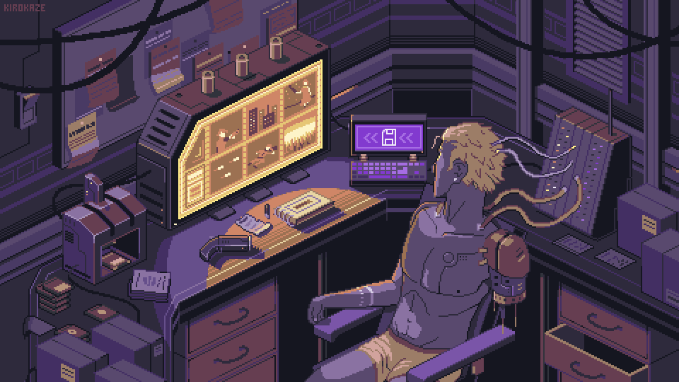

## Inspiration

Saw a random video from a youtuber called NetworkChuck who was talking about why you need your own website.

[Video link](https://youtu.be/gwUz3E9AW0w)

What I love about him is how enthusiastic he is about IT. And that inspired me to be the same. After watching just a couple of videos my whole perspective towards the vast unexplored field of IT changed. I was no longer afraid of it.

## Reason I was afraid of IT

Wait why was I even afraid? Well its mostly because of the complex jargon and the fact that I had no idea what I was doing. I was just following instructions. I thought there was no point in doing it if I didn't understand it. I was so wrong about that. Jumping into the unknown is scary, you'll come accross errors that you don't know how to fix. But stay with it, don't critise yourself for not getting it right away. Have that attitude. You learn something new from it be it so small. Leave it to time to make sense of it.

## Why do I need my own website?

I want to learn new stuff and not just touch it but really get into it till I can say that i have a clear understanding of it and can explain it to someone else. But its not like am gonna remember everything like a computer. I read somewhere that the human brain remembers stuff when it is either repeated or is associated with a strong emotion. So I thought why not write about it. I can always come back to it and refresh my memory. And if someone else finds it useful then that's great.

### retro-spective

which generally is a look back at events that took place, or works that were produced, in the past.
I put a hyphen there to highlight the word retro. I prefer the old and minimalistic look. Its muted and its calm for this stuff.

## Why start writing now?

I am clueless about that. I have never written about anything. Ig i am afraid to see how bad I will be at it. But honestly I am sick of being stuck at the same level. _I need a progress bar to fill for the experience i collect in my life_. I don't know why i wrote that in italics lol but it sounds cool. I am gonna keep it.

## What am I gonna write about?

Literally anything. Anime, mange, games, tech, thoughts or any new stuff i learn about or get confused about.

## Quotes

> I've only ever regretted the things I didn't do.

\- Atsushi Nakajima in Bungo Stray Dogs
