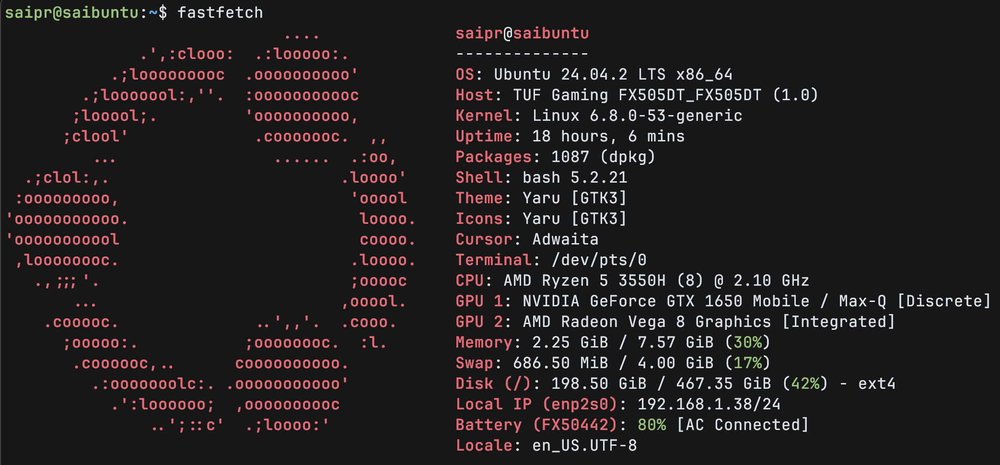
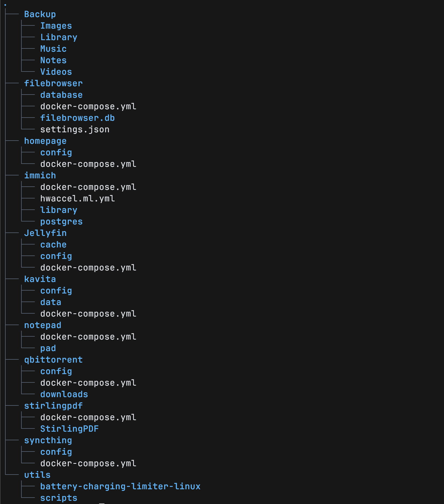

We constantly move files from one system to another and it gets tough to keep track of what lies where. This gets really important when it comes to sensitive files like personal photos, documents or even configuration files. Many prefer handing the control of files to a cloud service like Google photos and Drive. But Google is just a huge advertising company. Even if you don't care for privacy at some level (you should though, see the image below), I'm not convinced by the subscription models that these companies offer. With Google you get 15gb of free storage for an account and if i want more i need to pay a recurring fee for god knows how long.

Instead I had a old laptop/PC lying around not being used by anyone. It has 500 GB of storage left unused. What if i could make it my own cloud? Dump all my "digital life" and access it from anywhere in the world? thats awesome, at least that's what i think. Plus I am in control of my data.

This is my minimal fluff guide on setting up a home server as quick as possible.


## An old ASUS TUF

I chose Ubuntu Server to install on this. Below you can see the specs



## Tailscale VPN

Next is to be able to access this from anywhere and not just the local network. For that we use Tailscale. Install it on any device from which you want to access the server, it can be your phone, laptop, Android TV, etc.
<https://tailscale.com/download/>

It creates a VPN for all your devices linked using your Tailscale account. So in this new Tailscale network all your devices can see each other over the internet. You just need to add the device to your Tailscale account. It's literally just a 5 mins setup.

Once we got that done lets run services on our server!

## Docker and Docker Compose

There are two ways to go about running your services in you server (that i know of) which is Virtual Machines and Docker containers. They have their pros and cons mainly i think VMs offer better isolation and thus security but since i want this to be a minimal and fast setup, let's go with docker. Don't worry this simple server is secure enough if you don't have any port forwarding going on your router and the devices that are connected to the router are trustworthy.

I recommend learning about docker which would take 30mins? or even less honestly. This typecraft video might be helpful:
<https://www.youtube.com/watch?v=Ud7Npgi6x8E>

Every service can be managed by their own docker-compose.yml file. Below is the list of services i am currently running and you can see the file structure:
*(Backup and utils are not services but simple folders, i'll explain their use later)*



And use Portainer CE (another services for which i used docker-run to install) to manage your docker containers easily.

That's it. You have services running on your server and they can be accessed from Tailscale devices.

Make sure to give a secure password whenever they are launched for the first time to have an extra layer of security.

You can check out Samba as well which is gives the ability to attach network drives to your machines.

## A Note if you are using Laptop as a Server

This a laptop so you don't want the lid open and screen on all the time. To disable the suspend

```sh
sudo nano /etc/systemd/logind.conf
```

Uncomment following lines and change values to ignore:

```sh
HandleSuspendKey=ignore
HandleLidSwitch=ignore
HandleLidSwitchDocked=ignore
```

Save and Exit.

```shell
sudo systemctl restart systemd-logind
```

Also if you want the screen to turn off automatically when no activity:

<https://askubuntu.com/questions/1406135/turn-off-screen-ubuntu-server-on-surface-pro-4>
For Ubuntu server (no GUI), add `consoleblank=300` to your `GRUB_CMDLINE_LINUX_DEFAULT=` line in your `/etc/default/grub` file, for a 5 minute no activity, then go blank setting. Keep a copy of your original `/etc/default/grub` file first, and remember to run `sudo update-grub` afterwards, then re-boot.

Example from my grub file and **in context of other stuff on that line**:

```sh
GRUB_CMDLINE_LINUX_DEFAULT="ipv6.disable=1 consoleblank=314 intel_pstate=active intel_pstate=no_hwp msr.allow_writes=on cpuidle.governor=teo"
```

## About Services

### FileBrowser

Filebrowser is a self-hosted file managing interface that allows you to manage files and directories through a web interface. It's a simple and convenient way to access, upload, and manage your files remotely.

> Docker Compose:  <https://docs.techdox.nz/filebrowser/>
> This is not official docs but the docker image is.
>
### Homepage

A modern, *fully static, fast*, secure *fully proxied*, highly customizable application dashboard with integrations for over 100 services and translations into multiple languages. Easily configured via YAML files or through docker label discovery.

> Docker Compose: <https://gethomepage.dev/installation/docker/>

### Immich

Self-hosted photo and video management solution
Easily back up, organize, and manage your photos on your own server. Immich helps you browse, search and organize your photos and videos with ease, without sacrificing your privacy.

> Docker Compose: <https://immich.app/docs/install/docker-compose>

I am not using Immich for Photo Backup from phone to server. Instead all files go to my server through Syncthing or i upload them manually. I have a diagram later explaining the process. This allows me to keep my own file structure. And Immich has read only access to that folder.

### Jellyfin

Jellyfin is the volunteer-built media solution that puts *you* in control of your media. Stream to any device from your own server, with no strings attached. Your media, your server, your way.

> Docker Compose: <https://jellyfin.org/docs/general/installation/container/>

### Kavita

Lightning fast with a slick design, Kavita is a rocket fueled self-hosted digital library which supports a vast array of file formats. Install to start reading and share your server with your friends.

> Docker Compose: <https://wiki.kavitareader.com/installation/docker/lsio/>

### Notepad

This is an open-source clone of the now-defunct notepad.cc: "a piece of paper in the cloud".
<https://github.com/pereorga/minimalist-web-notepad>

> Docker Compose: <https://hub.docker.com/r/jdreinhardt/minimalist-web-notepad/tags>
> Not Official.

### Qbittorrent

The [Qbittorrent⁠](https://www.qbittorrent.org/) project aims to provide an open-source software alternative to µTorrent. qBittorrent is based on the Qt toolkit and libtorrent-rasterbar library.

> Docker Compose: <https://hub.docker.com/r/linuxserver/qbittorrent>

### Stirling PDF

Stirling PDF is secure, private, and centralised. With comprehensive PDF manipulation tools for all users from a single installation its perfect for office and personal use

> Docker Compose: <https://docs.stirlingpdf.com/Installation/Docker%20Install>

### Syncthing

Syncthing is a **continuous file synchronization** program. It synchronizes files between two or more computers in real time, safely protected from prying eyes. Your data is your data alone and you deserve to choose where it is stored, whether it is shared with some third party, and how it’s transmitted over the internet.

> Docker Compose: <https://hub.docker.com/r/linuxserver/syncthing>

## A Note on Syncthing

So below is how i am syncing and managing files. Syncthing and backup are different folders in server, everything from syncthing goes to backup folder one way (using rsync), only additions and updates but no deletions. Syncthing acts as a way to keep track of what I'm keeping offline in my devices and to bulk upload files to server. Otherwise, if i wanna just upload and instantly remove from phone then I'll send it directly to backup folder.

This setup has a little redundancy of data though (syncthing and backup folders might have same data twice) But the idea is syncthing to be very less size and backup the opposite in storage.


Following are the rsync commands in a bash script file. Only the Notes folder stays in perfect sync meaning even deletions occur in it.

```bash
#!/bin/bash

rsync -av /home/saipr/syncthing/config/Library/ /home/saipr/Backup/Library/
rsync -av /home/saipr/syncthing/config/Images/ /home/saipr/Backup/Images/
rsync -av /home/saipr/syncthing/config/Music/ /home/saipr/Backup/Music/
rsync -av --delete /home/saipr/syncthing/config/Notes/ /home/saipr/Backup/Notes/


```

And i have scheduled to run the script automatically using Cron.

1. Open the crontab editor:

```sh
crontab -e
```

2. Add this line at the bottom:

```sh
0 * * * * /home/saipr/backup.sh
```

### Explanation

| Field            | Value | Meaning                                       |
| ---------------- | ----- | --------------------------------------------- |
| **Minute**       | `0`   | Runs at the **start of the hour** (minute 0). |
| **Hour**         | `*`   | Runs at **every hour** (any hour).            |
| **Day of Month** | `*`   | Runs **every day** of the month.              |
| **Month**        | `*`   | Runs **every month**.                         |
| **Day of Week**  | `*`   | Runs **every day of the week**.               |

## Final Dashboard


## Further Improvements

These i also haven't done them yet but I'm mentioning:

- Backing up docker-compose files somewhere
- Shift to NixOS (better reproducibility if had to start over)
- Implement the 3-2-1 Backup rule
- VMs maybe?
- Making the docker containers expose on Tailscale net instead of listening on 0.0.0.0
- Adding Firewall rules maybe to only allow traffic from Tailscale IPs.

## What got me started

> [A reddit post &#xf1a1; &#xf46c;](https://www.reddit.com/r/HomeServer/comments/17vcllp/looking_for_a_minimalfluff_guide_to_first_home/)
