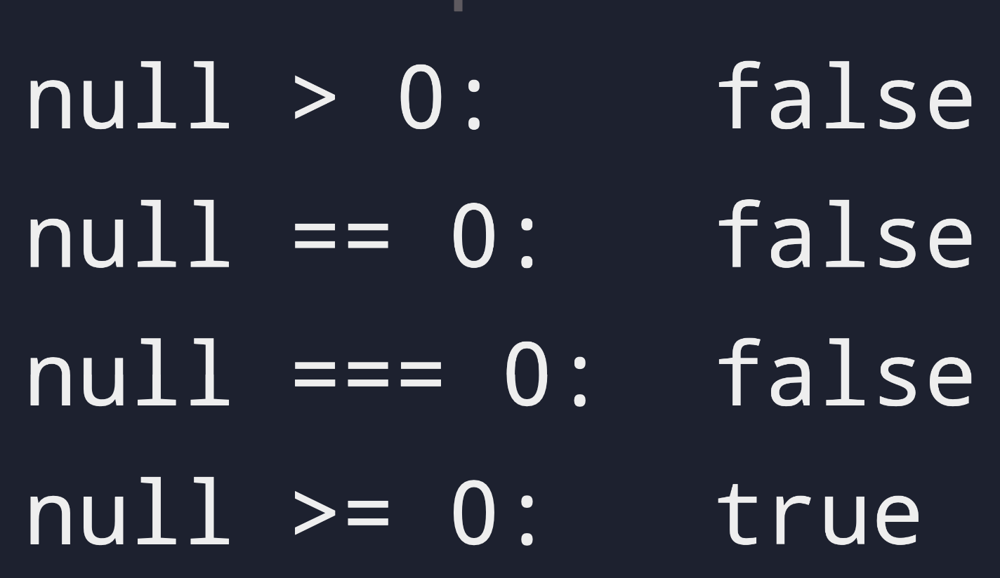

## We are complicating the web

Before i even start, go ahead and just read - <a href="https://justfuckingusehtml.com/" target="_blank" rel="noopener noreferrer">WordsOfGod&#xf46c;</a>  - &#xea6c; language warning though.

That says enough about the reason why i as well dropped my previous portfolio website which used astro framework and decided to built from scratch a simple website becuase thats'll all i need and most probably you too.

### Keep it simple

I have been working with Ruby these days and i realised the freedom and trust that language gives me. I never did a lot of coding with Javascript before, just saw the memes especially on its equality mechanism like one below:



> <a href="https://www.reddit.com/r/ProgrammerHumor/comments/1g60jaw/javascriptnullisnotgreaterorequaltozerobutalsoyes/" target="_blank" rel="noopener noreferrer">If you want the explanation&#xf46c;</a>

Yeah i honestly don't know how that works but i don't really care. Why would i even do that? If i did that - then its my fault - the programmers.

My point is Javascript is also a language that gives a lot of freedom and vanilla JS is capable of lot of things - i just realised this, to be honest probably not completely but i kinda get it.

### So that was my Inspiration

Yup, I built this from scratch and realised i can just host it here in github for free. Not needing to ever open another website like Netlify or Vercel. I can easily write my notes in markdown and using few libraries like marked and prism (thank you for the geniuses who made these) i can have them view as static websites and my code stays in github - the ever so best place to maintain ur code.

## Walkthrough

Well at first i created 4 html pages, few js and css files and hoped that they were enough. Then when creating the navbar i realised, when i was making too many changes to it, copying it over to other html is too cumbersome. why can't i just js to add it to my html? and then i was like wait js can handle my html any way i want sooo... instead of maintaining so many html why don't i just one html page?

### SPA

Yup, got to know that that is called a single-page application (SPA).
> A web application that loads a single HTML page and dynamically updates the content as the user interacts with it, without reloading the entire page from the server

I was having another issue when creating a simple theme toggle - switching to another html was giving white flash - NOPE - don't want that. Well this i first solved by having the html itself get the dark class instead of just the body. But well with SPA, I'm on the same html page.

### This gives me Confidence

I always the frameworks of JS - honestly afraid which do i even start with so i can start earning money - but the point is if you understand vanilla JS, thats good enough - is what i believe atleast.

My previous website was using astro framework and quite frankly i write blogs like with 6 months gap - so i always forget how to even setup the development environment. And that was an added friction to even get started to write another blog. Plus i constantly switch systems.

And with this - I am literally just typing directly from Neovim (my preferred editor) where i usually just code and not write such blogs/posts. But this setup allows me to do so - and easily push the changes to github at the same time.

Allowing me to write from any system i want.

This website can be served by a simple http server:

```sh
python3 -m http.server 8000
```

## Next Up

I had saved up a JS library that i saw in some reel - <a href="https://animejs.com/" target="_blank" rel="noopener noreferrer">AnimeJs&#xf46c;</a> - man, this website is so cool - the animations are just awesome. Well i always wanted to try it but i never had a website on which i wanted to try - even my previous astro framework website. You know after using arch - you develop a weird trait of everything feels like its bloat. Yeah that is me now - unfortunately.

Well I built this website in a day from scratch and pretty happy about it on how simple it can be and also look good. Adding animations would make it even coolor! Though I am not gonna add too much unnecessary animations, probably?

## Qoutes

> Everything should be made as simple as possible, but not simpler

\- Albert Einstein
