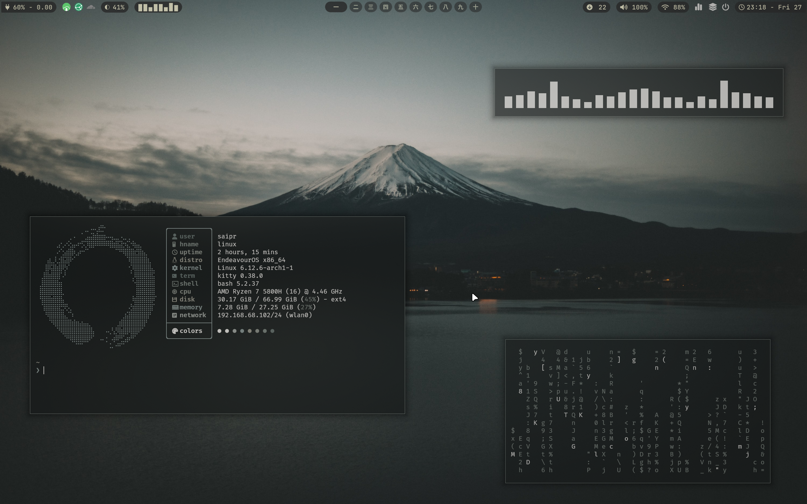
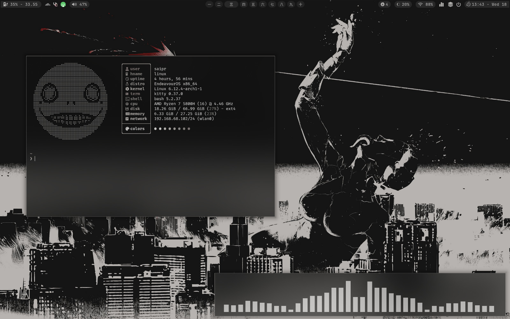

## so i started writing again...

First, yeah i know i started writing again after a long while. Well i was lazy, i always thought you have to write a whole blog in one sitting then upload it. 
This time i want to try a different approach. Just write a little everyday of the interesting stuff i found or learned and that can be shared. Well i know no one's gonna read these boring blogs but the main reason for still writing is for myself, it's a good way to keep track of things you learned and retrospect.

## Back to the main topic! LINUX
Why suddenly the shift? well seeing how Microsoft is pushing their AI stuff, copilot into windows plus windows 11 has always been buggy in terms of simple things like for example opening the notification tray?! On opening the notification tray for the first time why does it load so long? Another thing why can't i see battery percentage in the taskbar, the battery icon hardly tells anything, i have to hover it continuously to check. 
I can go on about the issues but this isn't about that. And honestly these aren't even the real reason for my switch to Linux. It's because i discovered something called window managers, specifically GlazeWM in windows.

## Window Managers
<a href="https://github.com/glzr-io/glazewm" target="_blank" rel="noopener noreferrer">GlazeWM&#xf46c;</a>
 is a window manager for windows. Now what is that? well the usual way a window opens in windows is called floating meaning you can drag it around the screen using mouse.
Most are used to this way of working with windows. A window manager is what handles the placement of the windows in a graphical user interface. Simply put you can make the windows open in 'tiling' mode or 'floating' mode.

See the video below how the terminal windows open, the first part is tiling mode and then the floating mode is toggled in the workspace

<a href="https://drive.google.com/file/d/1o51iynAsJaflLAk4lZXdGRc4CVNf7K8H/view?usp=drive_link" target="_blank" rel="noopener noreferrer">Video Link&#xf46c;</a>

<!-- <iframe src="https://drive.google.com/file/d/1o51iynAsJaflLAk4lZXdGRc4CVNf7K8H/preview" width="640" height="480" allow="autoplay"></iframe> -->
<!-- 
<video class="border-2 hover:border-accent rounded-lg" controls muted width="640" height="360">
    <source src="/src/assets/blogs/linux_exp/blog_wm.mp4" type="video/mp4">
    Your browser does not support the video tag.
</video> -->

## Why is it better?
Sometimes (well most of the times if i put my lazy ass to work) having a lot of windows open gets difficult to manage. Having a window minimised makes my mind forget about its location, to open it, its either ALT tabbing multiple times or its in another virtual desktop.
and when your are zoning in to your work, doing this in between really slows you down or pulls you out of the task at hand.

Many window managers usually default to tiling mode, that is having all the windows open in front of you and can be separated in workspaces. GlazeWM allowed this in windows. As i kept using, managing windows became so easy. With a simple key-bind i can switch to a different workspace and see the windows, without worrying if any window is hidden behind another or minimised and quickly move the cursor towards it and do the task.

## Wasn't the topic about Linux??
Yeah i know i am getting to it. So as i was using GlaceWM, i got to know the origin of its idea, like the key-binds and tiling manner, came from i3 which is a famous window manager in Linux. Though they were some other factors like customisation (the look and feel) of the desktop and my work required using the terminal often which in windows it took ages to open (reason partially being i had miniconda installed and had its environment activated by default)and nope i couldn't bear that delay anymore. I finally switched to Linux! 

(Confession... this isn't the first time i tried Linux and also currently i am still running a dual boot but i haven't opened windows since i dual booted. But this IS the first time i committed to using it as my main OS for over a month now)

## Endeavour OS & Hyprland
Making the shift to Linux comes with THE first responsibility of choosing your own operating system. By that i mean choosing your Linux distribution. Linux is actually just a kernel and there's a term called 'GNU' which you can lookup the history on it but essentially "GNU/Linux" this whole term together represents an operating system like Windows and Mac OS out there. And a distribution is flavours of GNU/Linux ig? Basically with different distros you get various packaged software and sometimes their ideologies also differ, like how the updates should happen or even the UI/UX choices.

Theirs Ubuntu, Linux Mint, Fedora, Pop Os, Kali Linux, etc. These i think usually are the most known ones or talked about or recommended as a beginner (Well this was the case in my engineering college). 

My goal was to try <a href="https://hyprland.org/" target="_blank" rel="noopener noreferrer">Hyprland&#xf46c;</a>
 which is similar to i3 and it seemed Arch was the top recommendation for it. I didn't have the time to bother with installing Arch Linux and Hyprland from scratch especially at the beginning of this transition. I wanted to quickly have a working setup so i ended up choosing Endeavour OS + ML4W Hyprland.

## ML4W Hyprland
It was a breeze setting up Hyprland with <a href="https://github.com/mylinuxforwork/dotfiles" target="_blank" rel="noopener noreferrer">ML4W dotfiles&#xf46c;</a>
 and provided a better way of exploring how the settings were configured for Hyprland. 
Then i started doing my own customisation and i think i currently have a config that i would in future replicate when i build hyprland from scratch.

## Utilities I use
Coming to Linux i came across many tools that sped up my workflow tremendously and most important kept me focused as it no longer felt lethargic to even just open the windows for a task or project to begin with.
Some of the most useful tools:
- <a href="https://yazi-rs.github.io/" target="_blank" rel="noopener noreferrer">yazi&#xf46c;</a>
- <a href="https://github.com/Qalculate/libqalculate" target="_blank" rel="noopener noreferrer">qalc&#xf46c;</a>
- Scratchpads in Hyprland
- Neovim - <a href="https://nvchad.com/" target="_blank" rel="noopener noreferrer">Nvchad&#xf46c;</a>
- <a href="https://github.com/ajeetdsouza/zoxide" target="_blank" rel="noopener noreferrer">Zoxide&#xf46c;</a>, 
  <a href="https://github.com/junegunn/fzf" target="_blank" rel="noopener noreferrer">fzf&#xf46c;</a>, 
  <a href="https://github.com/BurntSushi/ripgrep" target="_blank" rel="noopener noreferrer">ripgrep&#xf46c;</a>

## Screenshots
Mount Fuji

Neir Automata

## Summing Up
If i wrote everything i wanted to convey, this would become lengthy and boring real fast. 
To sum it up i won't be switching to windows except only for gaming. Linux and Hyprland has been amazing to use. I might create a video showcasing my setup and link it here in future. As in a video format you would be able to better see how the keybinds make it easier to navigate the desktop. Plus i might cover some utilities separately like scratchpads also. 

## Here's a 1 min video (not mine!)

> [Why I use Linux &#xf52c; &#xf46c; ](https://www.youtube.com/watch?v=jdUXfsMTv7o)

