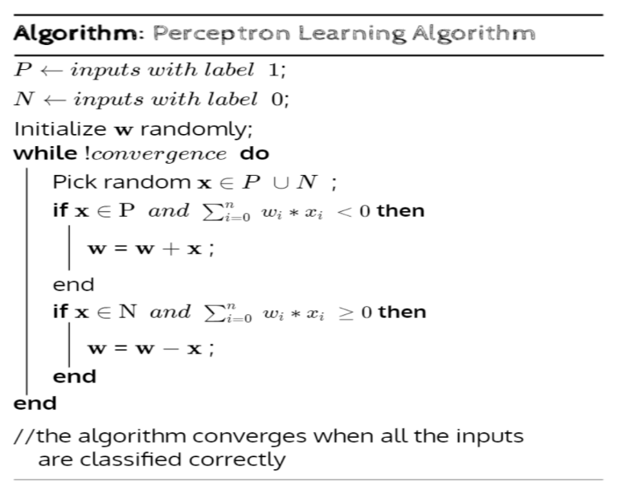
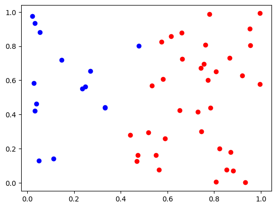
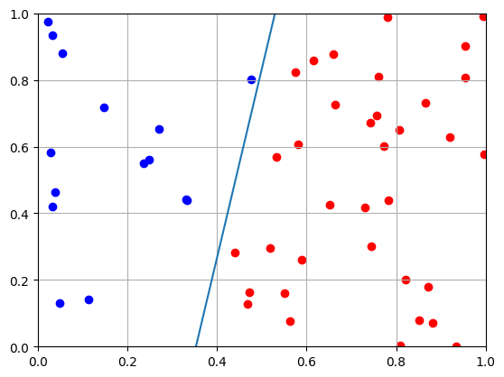

## Perceptron Learning Algorithm



### Generating Linearly Separable Data

```python
import numpy as np
import matplotlib.pyplot as plt
from IPython.display import clear_output
import random
```

```python
# P -> inputs with label 1;
# N -> inputs with label 0;
# I -> all inputs;

P, N = [], []
I = np.random.rand(50, 2)

# 5y = 2x + 1
for i in I:
    if 5*i[0] - 2*i[1] - 1 > 0:
        P.append(i.tolist())
    else:
        N.append(i.tolist())

# Plot
plt.scatter([i[0] for i in P], [i[1] for i in P], color='red')
plt.scatter([i[0] for i in N], [i[1] for i in N], color='blue')
plt.show()

# P = [(1.1, 2.1), (2.2, 2.5), (2.2, 0.5), (3.1, 1.2)]
# N = [(0, 0), (1.2, 0), (0, 1.3), (0.5, -0.5)]
# I = P + N
```



### Random Weights

```python
# w -> weights;
# Randomly initialize weights between 0 and 1
min_value = 1
max_value = 100
w = [random.random() for _ in range(2)]
```

### Bias and Learning Rate

```python
b = -1 # b -> bias;
a = 1 # a -> learning rate;
```

### Function to plot the decision boundary

```python
# Plotting function
def plot_points(P, N, w, b):
    plt.scatter([x[0] for x in P], [x[1] for x in P], c='r')
    plt.scatter([x[0] for x in N], [x[1] for x in N], c='b')
    plt.xlim(0, 1)
    plt.ylim(0, 1)
    plt.grid(True)
    x = np.linspace(-1, 3, 100)
    if w[1] == 0:
        w[1] = 0.0001 # Avoid division by zero
    y = -w[0]/w[1] * x - b/w[1]
    plt.plot(x, y)
    plt.draw()
    plt.pause(0.1)

```

### Aggregate function

```python
# Aggregate function
def aggregate(x, w, b):
    return sum([w[i]*x[i] for i in range(len(w))]) + b
```

```python
plot_points(P, N, w, b)
# Perceptron Learning Algorithm
def PLA(I, w, b):
    while True:
        flag = True
        for i in I:
            i = i.tolist()
            if i in P and aggregate(i, w, b) <= 0:
                w = [w[0] + a*i[0], w[1] + a*i[1]]
                flag = False
                # Plotting
                plot_points(P, N, w, b)
                clear_output(wait=True)
            elif i in N and aggregate(i, w, b) > 0:
                w = [w[0] - a*i[0], w[1] - a*i[1]]
                flag = False
                # Plotting
                plot_points(P, N, w, b)
                clear_output(wait=True)
        if flag:
            plot_points(P, N, w, b)
            break
    return w, b

# Run PLA
w, b = PLA(I, w, b)
print(w, b)
```



    [2.830934058092664, -0.49971814589930985] -1
