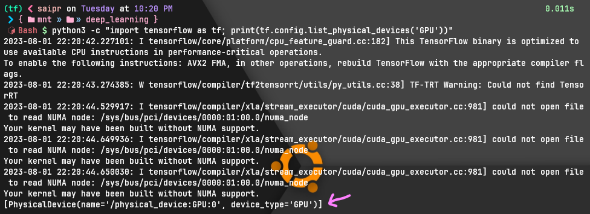

## Tasks

1. Setup tensorflow
2. Setup Pytorch

## Tensorflow

An open source software library for deep learning developed by Google and provides training and deployment.

Tensorflow GPU for version 2.10 and above do not support Windows Native. They can be installed in WSL2.

### Prerequisites

1. Nvidia CUDA and cuDNN Installation
2. WSL2
3. Miniconda

### Setup

Create a virtual environment with miniconda with name 'tf'. Activate it and follow through the Step-by-Step guide (scroll down the page) in official docs - [Install TensorFlow with pip](https://www.tensorflow.org/install/pip). <br>
Recommended to install the versions mentioned in the docs for stability.

Use `nvidia-smi` command to check that CUDA is properly installed. It lists the available GPU cards, as well as processes running on each card.


Verify GPU Install (From official docs)

```sh
python3 -c "import tensorflow as tf; print(tf.config.list_physical_devices('GPU'))"
```



### For Ubuntu version 22.04 (and WSL2)

Once you have completed installation you have to do these extra steps:

1. Install nvidia-cuda-toolkit

   ```sh
   sudo apt install nvidia-cuda-toolkit
   ```

   If it throws an error run the following command and try again

   ```sh
   sudo apt update
   ```

2. Next run the following commands

   ```sh
   conda install -c nvidia cuda-nvcc
   ```

   Verify installation by running `nvcc --version` <br>
   Run following commands

   ```sh
      sudo cp /usr/lib/wsl/lib/libcuda.so.1 /usr/lib/wsl/lib/libcuda.so.1.backup
      sudo cp /usr/lib/wsl/lib/libcuda.so /usr/lib/wsl/lib/libcuda.so.backup
      sudo rm -r /usr/lib/wsl/lib/libcuda.so.1
      sudo rm -r /usr/lib/wsl/lib/libcuda.so
      sudo ln -s /usr/lib/wsl/lib/libcuda.so.1.1 /usr/lib/wsl/lib/libcuda.so.1
      sudo ln -s /usr/lib/wsl/lib/libcuda.so.1.1 /usr/lib/wsl/lib/libcuda.so
      sudo ldconfig
    ```

    Following lines configures the XLA cuda directory

    ```sh
      mkdir -p $CONDA_PREFIX/etc/conda/activate.d
      printf 'export XLA_FLAGS=--xla_gpu_cuda_data_dir=$CONDA_PREFIX/lib/\n' >> $CONDA_PREFIX/etc/conda/activate.d/env_vars.sh
      source $CONDA_PREFIX/etc/conda/activate.d/env_vars.sh
    ```

    Following lines copies libdevice file to the required path

    ```sh
    mkdir -p $CONDA_PREFIX/lib/nvvm/libdevice
    cp $CONDA_PREFIX/lib/libdevice.10.bc $CONDA_PREFIX/lib/nvvm/libdevice/
    ```

3. Restart <br>
  This is what worked for me. I used python 3.9, tensorflow 2.13, CUDA 11.8 and cuDNN 8.6.0

## Pytorch

Relatively new deep learning framework based on Torch for simplicity, ease of use, efficient memory usage and dynamic computational graphs.

### Setup

Create new conda environment with name 'pt' and run the command after selecting preferences on [Start Locally | PyTorch](https://pytorch.org/get-started/locally/)


> Thank You
